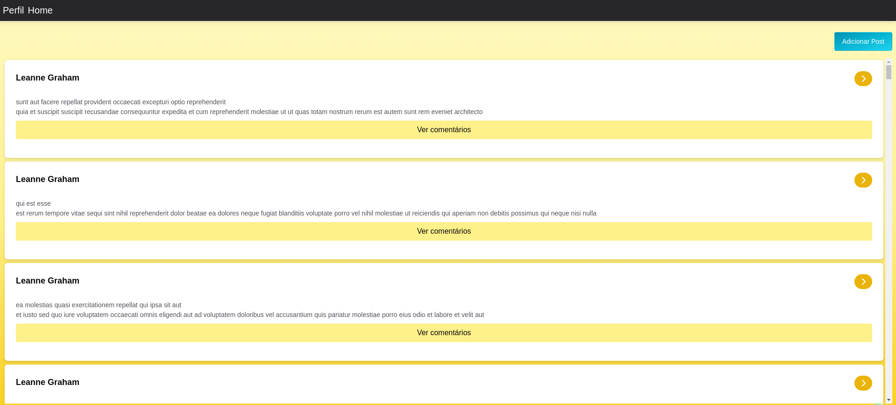

<div align="center">
  
  
</div>

<div align="center">

# Kolab CRUD

</div>

<div align="center">
  
</div>

## Sobre

O **Kolab CRUD** é uma aplicação construída com **ReactJS** e **TypeScript**, que explora conceitos avançados como tipagens, manipulação de formulários e integração com bibliotecas modernas. A aplicação foi desenvolvida para demonstrar boas práticas de desenvolvimento front-end, com ênfase na performance.

### Tecnologias Utilizadas

- [**TypeScript**](https://www.typescriptlang.org/) - Tipagens avançadas para garantir maior segurança e escalabilidade.
- [**ViteJS**](https://vitejs.dev/) - Bundler rápido e otimizado para o gerenciamento de recursos da aplicação.
- [**Chakra UI**](https://www.chakra-ui.com/) - UI Kit.
- [**React Query**](https://tanstack.com/query/v5/docs/framework/react/overview) - Data fetching e cache de dados.
- [**Axios**](https://axios-http.com/docs/intro) - Fetcher de dados.
- [**React Router**](https://reactrouter.com/) - Roteamento de páginas.
- [**Vitest**](https://vitest.dev/) - Testes unitários.

## Requisitos

Para rodar a aplicação, você precisará instalar algumas ferramentas de desenvolvimento. As seguintes tecnologias foram utilizadas neste projeto:

- [Visual Studio Code](https://code.visualstudio.com/) ou outro editor de sua preferência
- [Node.js](https://nodejs.org/en/) para gerenciar as dependências e executar o código
- [Git](https://gitforwindows.org/) para baixar o repositório (se estiver no Windows)
- [yarn](https://yarnpkg.com/) gerenciador de pacotes
- [pnpm](https://pnpm.io/) gerenciador de pacotes
- [playwright](https://playwright.dev/) para executar os testes do frontend

### Como Rodar a Aplicação

1. Clone o repositório:

   ```bash
    git clone https://github.com/Ricnaga/kolab-crud
   ```

2. Acesse a pasta do projeto:

   ```bash
    cd kolab-crud
   ```

3. Instale as dependências do projeto:

- Usando yarn, npm ou pnpm:

  ```bash
  $ yarn
  $ npm run install
  $ pnpm install
  ```

4. Inicie a aplicação:

   ```bash
   $ yarn dev
   $ npm run dev
   $ pnpm dev
   ```

O navegador abrirá automaticamente com a aplicação rodando em http://localhost:3000.

### Testes

```bash
$ yarn test
$ npm run test
$ pnpm test
```

Você pode verificar a cobertura dos testes no terminal ou acessando o arquivo index.html da pasta coverage que foi criada após executar o comando acima

## Contribuições

Se você deseja contribuir para o projeto, fique à vontade para enviar pull requests ou abrir issues.
